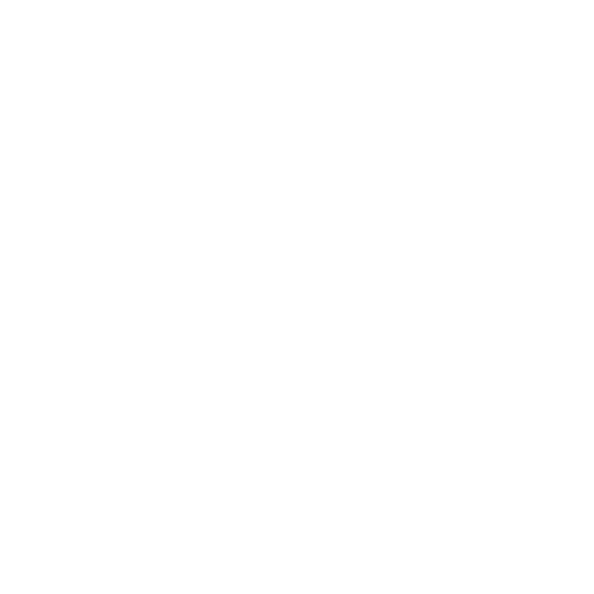

<p align="center"></p>

# doclick

Minimalist always-on-top overlay for Dofus 3 (Unity) team play. Toggle
broadcast, click on whichever Dofus window is on top, and the same click is
replayed on every other tracked Dofus window &mdash; useful for plowing
through per-account NPC dialogs, bank menus, and HUD interactions without
alt-tabbing eight times.

> **Scope.** Click broadcast, key broadcast, basic window organizer. Dofus 3
> already gives you combat auto-focus, auto-follow, and auto-join &mdash;
> doclick doesn't try to replace those. Use them for movement; use doclick
> for per-account UI clicks.

## Disclaimer

doclick is an **alt-tab + click simulator**, like a macro. It runs entirely
on Windows public APIs &mdash; no process injection, no memory hooks, no
packet reading, no interaction with the Dofus client beyond the synthetic
input you would otherwise produce yourself.

## Download &amp; install

Grab the latest installer from the
[Releases](https://github.com/tolkee/doclick/releases/latest) page and run
it. The installer is an unsigned NSIS `.exe`; on first launch Windows
SmartScreen will warn that the publisher is unknown &mdash; click **More
info** &rarr; **Run anyway**. The installer bundles the WebView2 bootstrapper
and will fetch the runtime if it isn't already present (Windows 11 ships it
preinstalled).

A code-signing certificate is on the long-term roadmap; until then the
SmartScreen prompt is unavoidable.

## Build from source

Prerequisites:

- Windows 10 / 11
- [Bun](https://bun.sh) (1.3+)
- Rust (stable, MSVC toolchain) &mdash; install from <https://rustup.rs>
- Microsoft C++ Build Tools (Tauri prerequisite)
- WebView2 runtime (preinstalled on Windows 11)

Build:

```powershell
bun install
bun run tauri build
```

The NSIS installer lands at
`src-tauri/target/release/bundle/nsis/doclick_<version>_x64-setup.exe`.

## Develop

```powershell
bun install
bun run tauri dev
```

The first `cargo build` will take several minutes while it compiles the
`windows` crate. Subsequent runs are incremental.

### Layout

```
src/                  React UI (overlay bar + settings window)
src-tauri/            Rust backend
  src/
    state.rs          shared AppState
    config.rs         JSON profile persistence
    commands.rs       Tauri command surface
    events.rs         event payload types
    windows/          enumerate / geometry / focus (SetForegroundWindow trick)
    hooks/            WH_MOUSE_LL / WH_KEYBOARD_LL on a dedicated thread
    broadcast/        focus-cycle dispatcher + proportional coord translation
```

### Stack

- Tauri 2 (Rust + Vite + React 19 + TypeScript)
- Tailwind v4 for styling, Zustand for state
- Win32 via the `windows` crate

## Contributing

Issues and pull requests are welcome. A few ground rules:

- Windows 10 / 11 only &mdash; cross-platform changes will be closed.
- doclick stays a click/key simulator. No memory reading, no packet
  inspection, no Dofus-specific automation that goes beyond replaying user
  input.
- Keep the dependency footprint small.
- Code submitted to this repo must be compatible with the project's
  noncommercial license (see below).

## License

[PolyForm Noncommercial 1.0.0](./LICENSE). Personal and non-commercial use,
modification, and redistribution are permitted. Commercial use is
prohibited.
